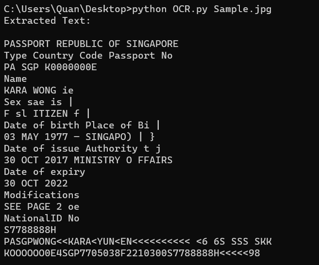

# Extract Text from images using Tesseract OCR
This is a Python script that utilizes Tesseract OCR to extract text from images and convert them into text format. The script allows users to upload images through the command line or by specifying a file path within the code. It is created as a baseline for future developments

## Results
| [Sample Image](https://en.wikipedia.org/wiki/File:Biodata_page_of_Singapore_Passport.jpg)                              | Sample Output                              |
| ------------------------------------------ | ------------------------------------------ |
|    |      |


## Requirements
- Tesseract OCR: You need to have Tesseract OCR installed on your system. You can download it from the official GitHub repository: [Tesseract OCR](https://github.com/tesseract-ocr/tesseract).
- Python libraries: Install the required libraries using pip:
 ```bash
pip install -r requirements.txt
```
## Usage
1. Open a terminal or command prompt.
2. Navigate to the directory containing the OCR.py script.
3. To extract text from an image, run the script with the image file path as an argument:
```bash
python OCR.py path/to/your/image.jpg
```


## Configuration
Tesseract executable path: If your system does not automatically detect the Tesseract executable, you will need to set the pytesseract.pytesseract.tesseract_cmd variable in the script(Line 7) to the correct path.
```bash
pytesseract.pytesseract.tesseract_cmd = r'c:\Program Files\Tesseract-OCR\tesseract.exe'
```

## Future explorations
 - Create a User Interface (UI) to edit processed Text, allowing additional features like text selection, formatting options, and the ability to correct any OCR errors. This also allows users to copy the extracted text and paste it directly into other applications or forms. This will make it easier to use the extracted text for various purposes, such as data entry or content generation.
 
 - Implement a for loop that processes each image one by one and outputs the extracted text for all images in a single run. This will streamline the text extraction process for large volumes of images.
 - Continue experimenting with different image pre-processing techniques to further improve OCR accuracy.
 - Optimize performance by using multi-threading or multiprocessing to help speed up the text extraction process.
 - Integrate natural language processing techniques to perform advanced analysis such as keyword extraction on the extracted text. 

